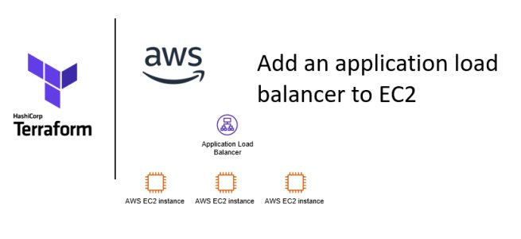

# Configure application load balancer to AWS EC2 using Terraform

[]

> A highly available application has higher chances of attracting customers because they are assured of consistency in service. Load balancing is a cost-effective way to increase an application’s availability. In this note, I describe the steps to add an application load balancer to three EC2 instances hosted in three different availability zones in a region using Terraform.

# Step 1: Create a target group
- Per AWS-Docs, a target group is used to route requests to one or more registered targets. I specified the port and protocol that this target group was listening to.

# Step 2: Attach the target group to the AWS instances
- In this step, I attached the aws_lb_target_group to the three EC2 instances and specified the port number on which traffic would be routed.

# Step 3: Create the load balancer
- Then I created the load balancer and attached a security group and a set of subnets.

# Step 4: Create a listener
- Finally, I attached the load balancer to the target group. Per AWS-Docs, a listener is a process that checks for connection requests, using the protocol and port that you configure. The rules that you define for a listener determine how the load balancer routes requests to its registered targets.

- With all the above code, I ran the usual Terraform commands terraform apply (after initializing the repository). And after Terraform provisioned the resources, I received the message below. That is due to the specification in the output block (in the output.tf file).

- This is the load balancer DNS name. I typed that on my web browser, and the request was randomly routed to one of the EC2 instances’ index.html page. The request was routed to a different EC2 instance with each web browser refresh. And that is how an application load balancer works. Other concepts are at play, like health checks and session stickiness, which I will discuss in a subsequent post.

