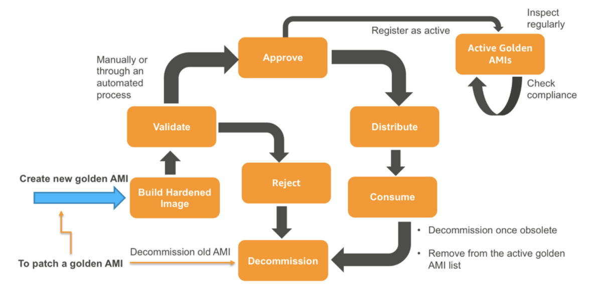

# packer custom image creation

[]
[]
[]
[]
[]
[]

```
provider "aws" {
  region = "us-east-1"
}

# Find an official Ubuntu AMI

data "aws_ami" "ubuntu" {
  most_recent = true

  filter {
    name   = "name"
    values = ["ubuntu/images/hvm-ssd/ubuntu-focal-20.04-amd64-server-*"]
  }

  filter {
    name   = "virtualization-type"
    values = ["hvm"]
  }

  filter {
    name   = "architecture"
    values = ["x86_64"]
  }

  owners = ["099720109477"] # Canonical official
}


resource "aws_instance" "app" {
  ami           = data.aws_ami.ubuntu.id
  instance_type = "t2.micro"
}
```


```
wget -O- https://apt.releases.hashicorp.com/gpg | gpg --dearmor | sudo tee /usr/share/keyrings/hashicorp-archive-keyring.gpg
echo "deb [signed-by=/usr/share/keyrings/hashicorp-archive-keyring.gpg] https://apt.releases.hashicorp.com $(lsb_release -cs) main" | sudo tee /etc/apt/sources.list.d/hashicorp.list
sudo apt update && sudo apt install terraform
```

```
terraform version
```

```
wget -O- https://apt.releases.hashicorp.com/gpg | gpg --dearmor | sudo tee /usr/share/keyrings/hashicorp-archive-keyring.gpg
echo "deb [signed-by=/usr/share/keyrings/hashicorp-archive-keyring.gpg] https://apt.releases.hashicorp.com $(lsb_release -cs) main" | sudo tee /etc/apt/sources.list.d/hashicorp.list
sudo apt update && sudo apt install packer
```

```
packer -version
```

```
apt install awscli
```

```
export AWS_ACCESS_KEY_ID=XXXXXXXXXXXX
export AWS_SECRET_ACCESS_KEY=XXXXXXXXXXXXXXXXXXX
```

# List all the AWS available images and find the owners id

```
aws ec2 describe-images --owners self amazon > output.txt
```

```
packer build ebs.json
```