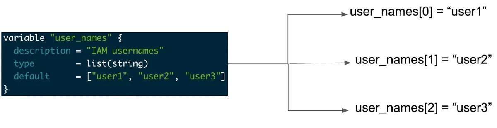
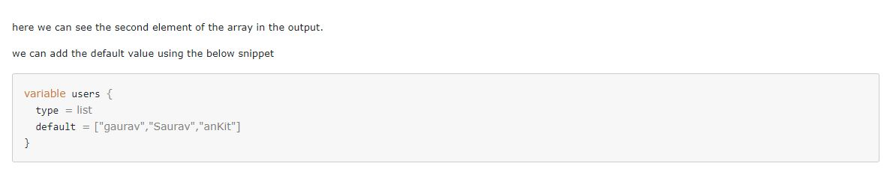

# List Variable

- How do you use list variables in Terraform?
> All files in your Terraform directory using the . tf file format will be automatically loaded during operations. Create a variables file, for example, variables.tf and open the file for edit. Add the below variable declarations to the variables file.

- https://upcloud.com/resources/tutorials/terraform-variables

[]

[]

