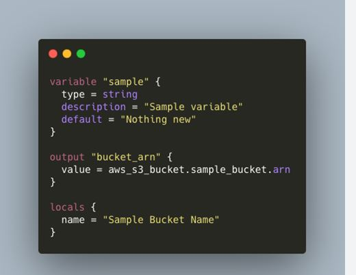

# Output Variable

- What is output variable in Terraform?
> Output values make information about your infrastructure available on the command line, and can expose information for other Terraform configurations to use. Output values are similar to return values in programming languages.

[]