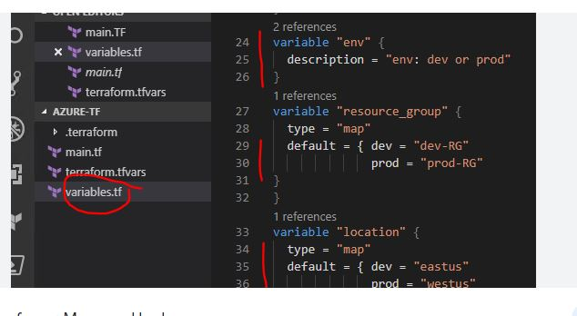
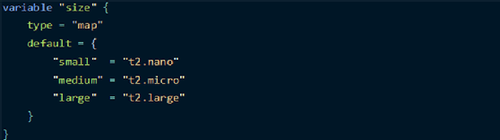
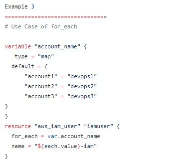
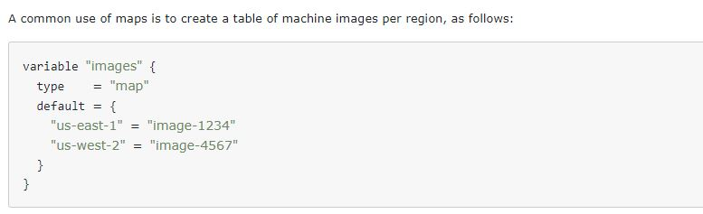

# MAP Variable

- What is a Terraform map variable?

> Variables in Terraform are a great way to define centrally controlled reusable values. The information in Terraform variables is saved independently from the deployment plans, which makes the values easy to read and edit from a single

[]

[]

[]

[]